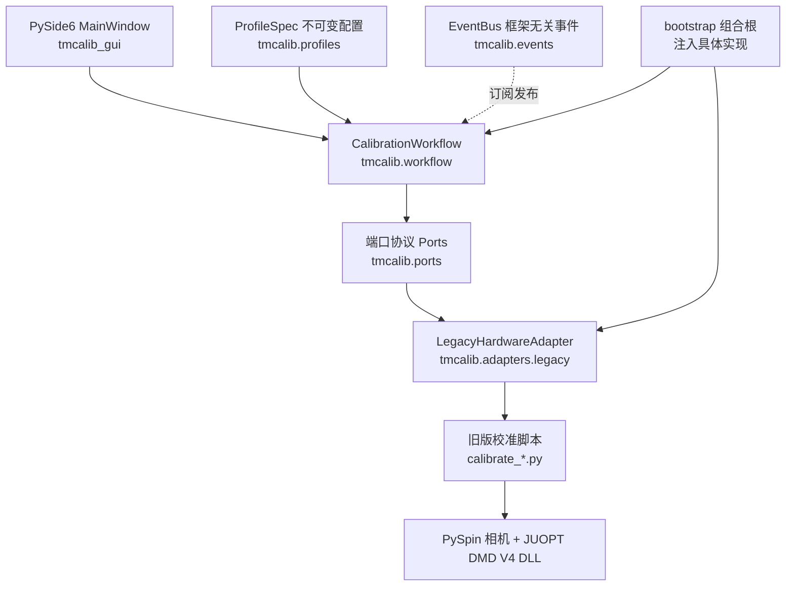
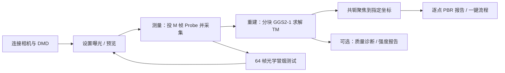

本页是 TMCalib 知识库的入口，面向刚开始接触该仓库的开发者。你将了解这个项目"测量什么、为什么这样组织、代码分为哪几层、按什么顺序阅读后续文档"，而不会深入某一模块的实现细节。读完本页后，请按文末推荐路径进入[快速开始](2-kuai-su-kai-shi)或你关心的专题页。

## 项目定位：在散射介质中"看穿"光场

TMCalib 是一套**光传输矩阵（Transmission Matrix, TM）测量与聚焦平台**，用于 JUOPT DLP/DMD（数字微镜器件）与 FLIR/Teledyne 偏振相机的实验控制：先在 DMD 上投影大量已知的全息编码探针（Probe），用偏振相机同步采集散射后的光斑，再通过 GGS2-1 算法重建"输入模式 → 输出像素"的复振幅传输矩阵，最后利用该矩阵生成共轭聚焦全息图，使光能量汇聚到相机靶面的任意目标像素。仓库由原实验目录中的 `combined_app_v4.py`、`combined_app_v4_128.py` 与 `llh_v2` 整理而来，实验数据、厂商 SDK 与历史代码快照没有进入版本库。
Sources: [README.md](README.md#L1-L5)、[README.md](README.md#L160-L168)

一句直观的比喻：散射介质相当于把光"搅乱"的毛玻璃。如果我们能测出"从每一个可编程输入像素到每一个相机输出像素"的复振幅响应表（即传输矩阵），就等于拿到了逆推的钥匙——测完这张表后，不需要真的看穿介质，只要反向编码，光就能在目标位置重新聚焦。本仓库所有测量、重建与"逐点聚焦/PBR 报告"功能都是围绕这张"响应表"展开的。
Sources: [README.md](README.md#L3-L5)、[docs/TM_RECONSTRUCTION_128.md](docs/TM_RECONSTRUCTION_128.md#L1-L19)

## 物理链路与软件分层：一句话总览

整条实验链路可以压缩为一句话：**随机复振幅探针 → 全息编码成二值 DMD 图案 → 相机逐帧采集 → 落盘为 memmap 测量矩阵 → 分块 GPU 重建传输矩阵 → 共轭编码逐点聚焦并量化 PBR**。软件层面则刻意分成两条并存的"血脉"：

- **实验验证过的单文件后端**：`calibrate_*.py` 系列（数千行、含 Tk 界面），保留了经过实际硬件验证的相机–DMD 触发与采集时序；
- **模块化应用核心**：`tmcalib/` 包 + `tmcalib_gui/` 统一界面，把后端包装成可注入的端口，供新的 PySide6 界面、命令行和测试共用同一条工作流。
Sources: [docs/ARCHITECTURE.md](docs/ARCHITECTURE.md#L86-L100)、[README.md](README.md#L20-L44)

下面的架构图展示了模块化一侧的依赖方向——注意箭头从 UI 指向 Workflow，Workflow 只依赖抽象端口，厂商 SDK 被隔离在适配器之后延迟加载：



依赖方向的约束是：`tmcalib.workflow` 不导入 Qt、Tkinter、PySpin 或任何校准脚本，只依赖 `tmcalib.ports` 中的 Protocol 接口；`tmcalib.bootstrap` 是唯一"选择实现"的组合根。测试因此可以注入同一个 `FakeHardware` 对象而无需真实相机与 DMD。
Sources: [docs/ARCHITECTURE.md](docs/ARCHITECTURE.md#L29-L45)、[tmcalib/bootstrap.py](tmcalib/bootstrap.py#L11-L27)、[tmcalib/adapters/legacy.py](tmcalib/adapters/legacy.py#L1-L17)

各层职责可以用下表概括，这也是后续[模块化架构与依赖方向约束](7-mo-kuai-hua-jia-gou-yu-yi-lai-fang-xiang-yue-shu)一页要展开的主题：

| 层 | 责任 | 允许依赖 |
| --- | --- | --- |
| `tmcalib_gui` | 渲染与用户输入（唯一 PySide6 界面） | workflow、events、profiles |
| `tmcalib.workflow` | 连接/测量/重建/聚焦用例编排 | ports、events、profiles |
| `tmcalib.ports` | 稳定的硬件与算法契约 | 仅 Python 标准库 |
| `tmcalib.profiles` | 尺寸、默认值、能力、策略标识 | 仅 Python 标准库 |
| `tmcalib.adapters` | 把端口翻译给旧控制器 | 旧版脚本与厂商 SDK |
| 旧版 `calibrate_*.py` | 实验验证过的采集与触发序列 | 厂商 SDK 与算法 |

Sources: [docs/ARCHITECTURE.md](docs/ARCHITECTURE.md#L37-L44)

## 支持的测量配置（Profile）

不同实验只差"输入栅格、DMD 映射、相机 ROI 与偏振通道"，其余测量、重建与聚焦代码共用一条路径。`ProfileSpec` 是不可变数据类，只保存尺寸、默认曝光、能力和策略键，绝不包含 GUI 或线程生命周期代码。
Sources: [tmcalib/profiles.py](tmcalib/profiles.py#L9-L38)

| Profile 键 | DMD 逻辑输入 | DMD 有效区 | 相机输出 | 说明 | 重建器键 |
| --- | --- | --- | --- | --- | --- |
| `v4_32x24` | 32×24 | 全幅 1024×768 | 128×128 | 原 v4 粗网格程序 | `ggs21_pinv` |
| `v4_32x24_cholesky` | 32×24 | 全幅 1024×768 | 128×128 | v4 的 Cholesky 重建入口 | `ggs21_cholesky` |
| `fourfold_128x96` | 128×96 | 全幅 1024×768 | 128×128 | 8×8 宏像素对齐铺满 DMD | `ggs21_cholesky` |
| `fivefold_160x120` | 160×120 | 全幅 1024×768 | 128×128 | 中心对齐最近邻扩展铺满 DMD | `ggs21_cholesky` |
| `dense_128x128` | 128×128 | 中央 512×512 | 128×128 | 稠密输入主配置 | `complex32_pinv` |
| `dense_128x128_roi26` | 128×128 | 中央 512×512 | 26×26 | 支持 I0/I90 偏振通道选择 | `complex32_pinv` |

Sources: [tmcalib/profiles.py](tmcalib/profiles.py#L41-L132)、[README.md](README.md#L7-L18)

上面的表只列"标准输入尺寸"；同一个 `dense_128x128` 家族还可通过 4N/8N 数据集、64 帧光学测试、partial TM 聚焦等能力组合出多种运行模式。每个 Profile 对外暴露统一的基础能力集合（曝光、预览、测量、重建、聚焦、逐点报告），而偏振选择、一键标定、远程重建等按需通过能力声明暴露——GUI 依据 `profile.supports(capability)` 决定启用哪些控件，而不是按文件名或 Profile 特化界面。
Sources: [docs/ARCHITECTURE.md](docs/ARCHITECTURE.md#L59-L70)、[tmcalib/profiles.py](tmcalib/profiles.py#L48-L57)

## 统一工作流：测量 → 重建 → 聚焦

无论从 PySide6 控制台、命令行还是测试进入，最终都落到 `CalibrationWorkflow` 这同一个用例编排器。它把硬件操作串行化到单 worker 的 `ThreadPoolExecutor`，避免测量、重建、聚焦并发争抢相机/DMD；工作流不关心 Qt，而是向框架无关的 `EventBus` 发布状态、日志、进度、帧与结果事件，GUI 通过 `QtEventBridge` 把事件搬运到 Qt 线程再触碰控件。
Sources: [tmcalib/workflow.py](tmcalib/workflow.py#L46-L62)、[tmcalib/events.py](tmcalib/events.py#L13-L31)、[docs/ARCHITECTURE.md](docs/ARCHITECTURE.md#L103-L107)



工作流内部是一个显式状态机（`DISCONNECTED / IDLE / MEASURING / RECONSTRUCTING / FOCUSING / PIXELWISE_FOCUSING / ONE_CLICK / STOPPING / ERROR / CLOSED`）。所有耗时操作经 `_submit` 包装：先校验当前状态是否允许该操作，再在 worker 线程执行并把成功/失败翻译成事件；测量、重建与逐点报告等操作都会先做 `profile.supports(...)` 能力检查并校验聚焦坐标是否落在相机 ROI 内。
Sources: [tmcalib/workflow.py](tmcalib/workflow.py#L22-L34)、[tmcalib/workflow.py](tmcalib/workflow.py#L104-L152)、[tmcalib/workflow.py](tmcalib/workflow.py#L188-L231)

在旧版后端中，"一键标定"本身就是"测量 → 恢复 TM → 逐点报告"的有序串联，而在模块化工作流里它被提升为 `one_click` 用例，复用同样的三个端口调用——这正是新界面能对所有 Profile 使用同一套按钮的原因。偏振 Profile（26×26 ROI）不再维护相机/控制器副本，而是通过 `select_channel` 从不可变配置派生出带通道标签的新 Profile，实现与数据流完全共用。
Sources: [tmcalib/workflow.py](tmcalib/workflow.py#L233-L255)、[tmcalib/profiles.py](tmcalib/profiles.py#L21-L36)、[calibrate_128x128_26x26.py](calibrate_128x128_26x26.py#L1-L29)

## 光学编码与 DMD 映射的三条路线

"逻辑输入"不能直接投到 DMD，必须经过超像素全息编码。仓库内有两个映射族：

**128×128 稠密族**（`dense_*`）：每个逻辑输入对应一个 4×4 光学超像素，`INPUT_MACRO_PIXEL_SIZE=4`，生成的 512×512 二值全息图居中放在 1024×768 DMD 上，外围像素保持 0。
Sources: [dmd_pattern_128.py](dmd_pattern_128.py#L1-L40)

**全幅填充族**（`fourfold_128x96`、`fivefold_160x120`）：目标是不留外围空白地铺满整个 DMD。128×96 输入先按 2×2 重复到 256×192 超像素网格（对齐 8×8 DMD 宏像素），160×120 输入则用中心对齐最近邻填充到同一网格，随后都以 4×4 `holo_SP` 瓦片编码，最终 1024×768 全幅参与编码，映射契约分别为 `aligned_repeat2_128x96_to_256x192_v1` 与 `nearest_fill_160x120_to_256x192_v1`。
Sources: [dmd_pattern_128x96.py](dmd_pattern_128x96.py#L1-L48)、[dmd_pattern_160x120.py](dmd_pattern_160x120.py#L1-L52)、[calibrate_128x96.py](calibrate_128x96.py#L1-L26)

超像素编码依赖 `holo_SP`（以及 parallel/orthogonal Lee、off-axis 等全息函数）和由 `generate_lut` 预先构建的查找表——LUT 记录"超像素内各微镜开关组合 → 可实现的复振幅"映射，编码时把目标复数查表得到最接近的微镜组合。160×120 的最近邻映射无法复用整数倍栅格的快速编码，因此其焦点编码器在 GPU 上实现 CUDA 版本，失败时自动回退到 bit-exact 的 NumPy 实现。
Sources: [holograms/dmd_holograms.py](holograms/dmd_holograms.py#L44-L134)、[holograms/generate_LUT.py](holograms/generate_LUT.py#L3-L48)、[calibrate_160x120.py](calibrate_160x120.py#L107-L223)

**这些编码细节分别对应深度解析中的[相机–DMD 触发时序与采集链路](13-xiang-ji-dmd-hong-fa-shi-xu-yu-cai-ji-lian-lu)、[DMD 超像素映射策略](14-dmd-chao-xiang-su-ying-she-ce-lue)与[全息编码器与查找表机制](15-quan-xi-bian-ma-qi-yu-cha-zhao-biao-ji-zhi)三页，本页不展开。**

## 仓库布局速览

```text
TMCalib/
├── run_gui.py                      # PySide6 统一桌面控制台入口
├── run_calibration.py              # 命令行/脚本化统一启动器（映射到旧 Profile 模块）
├── tmcalib/                        # 模块化应用核心
│   ├── profiles.py                 #   ProfileSpec + PROFILES 注册表
│   ├── ports.py                    #   六类端口 Protocol
│   ├── workflow.py                 #   CalibrationWorkflow + 状态机
│   ├── bootstrap.py                #   组合根 build_workflow
│   ├── events.py                   #   框架无关事件总线
│   ├── adapters/legacy.py          #   延迟加载旧后端的兼容适配器
│   └── testing.py                  #   测试用 FakeHardware
├── tmcalib_gui/                    # 唯一的 PySide6 界面 + CLI 辅助
├── calibrate_128x128.py            # 128 网格共享核心（相机+DMD+重建+聚焦，约 6000 行）
├── calibrate_128x96.py / _160x120.py / _128x128_26x26.py   # 薄 Profile 包装
├── calibrate_v4_32x24.py / _cholesky.py                    # 原 v4 主程序
├── dmd_pattern_*.py                # 各 Profile 的 DMD 映射模块
├── tm_reconstruction_128.py        # 通用分块 GGS2-1 重建器
├── low_precision_pinv.py           # planar-complex32 低精度逆
├── holograms/                      # 全息编码器与 LUT 生成
├── tools/                          # 数据集生成、诊断与分析工具
├── tests/                          # 合成数据回归测试
├── notebooks/                      # 分析 Notebook
└── docs/                           # 架构、硬件、数据说明
```

Sources: [README.md](README.md#L20-L44)

两个入口的分工值得强调：`run_calibration.py` 通过 `importlib` 映射到 `calibrate_*.py` 各 Profile 模块并启动它们的 `Application`（旧 Tk 界面），用于无桌面环境或硬件回退对照；`run_gui.py` 则驱动同一套 `CalibrationWorkflow`，不启动任何第二套 Tk 界面。
Sources: [run_calibration.py](run_calibration.py#L1-L46)、[README.md](README.md#L64-L98)、[docs/ARCHITECTURE.md](docs/ARCHITECTURE.md#L86-L92)

## 环境与数据规模：必须先知道的三个约束

**约束一：运行平台固定。** 厂商 Python 扩展是 `JUOPT_V4_PYTHON_DLL.cp38-win_amd64.pyd`，因此测量机固定为 Windows x64 + CPython 3.8；PyTorch 2.4.1 需要自行按显卡驱动安装 CUDA 12.1 版本。`PySpin` 与 JUOPT SDK 必须由硬件厂商安装，`pip` 无法安装。
Sources: [README.md](README.md#L46-L62)、[environment.yml](environment.yml#L1-L19)、[docs/HARDWARE_SETUP.md](docs/HARDWARE_SETUP.md#L1-L16)

**约束二：数据不在 Git 里。** Probe/Pattern、测量 memmap、Cholesky/伪逆缓存、TM 与报告文件全部由 `.gitignore` 排除；克隆后需要单独从实验存储恢复。即使如此，这些文件也必须从仓库根目录启动才能保持相对路径一致。
Sources: [README.md](README.md#L126-L138)、[docs/DATA_MANAGEMENT.md](docs/DATA_MANAGEMENT.md#L1-L13)

**约束三：数据量可能上百 GiB。** 下表是文档记录的典型规模，规划磁盘前请先阅读[数据管理与实验归档规范](25-shu-ju-guan-li-yu-shi-yan-gui-dang-gui-fan)：

| 输入 × Pattern 集 | 相机输出 | Probe + Pattern | 测量矩阵（uint16） | TM（complex64） |
| --- | --- | ---: | ---: | ---: |
| 128×128，8N | 128×128 | 约 112 GiB | 4 GiB | 2 GiB |
| 128×128，8N | 26×26 | 共用上行数据 | 169 MiB | 84.5 MiB |
| 128×96，8N | 128×128 | 81 GiB | 3 GiB | 1.5 GiB |
| 160×120，8N | 128×128 | 134.5 GiB | 4.69 GiB | 2.34 GiB |

Sources: [docs/DATA_MANAGEMENT.md](docs/DATA_MANAGEMENT.md#L15-L33)

## 重建、聚焦验证与实验归档的完整闭环

重建侧的核心是可扩展的**分块 GGS2-1** 求解器：完整 Probe 矩阵尺寸为 (M, 16384)，因此在相机输出维度分块求解 `(XᴴX + ridge·I)⁻¹XᴴY`，支持两条路径——complex64 X + 缓存 Cholesky 因子，或 planar-complex32 X + 预计算的正则化伪逆；结果写入可断点续算的 complex64 memmap，中断后重跑会从已完成输出块继续。每个相机输出像素最终都可生成共轭聚焦全息图，进而支撑"单点聚焦 → 部分 TM 验证 → 全量 16384 点逐像素 PBR 报告"的递进验证链。
Sources: [tm_reconstruction_128.py](tm_reconstruction_128.py#L1-L11)、[docs/TM_RECONSTRUCTION_128.md](docs/TM_RECONSTRUCTION_128.md#L1-L19)、[calibrate_128x128.py](calibrate_128x128.py#L3359-L3463)

除主链路外，仓库根目录与 `experiments/` 中还有顺序聚焦优化（32×24 direct sequential focus）、HDR PBR 测量（低/高曝光分别测峰与背景再按曝光归一化）等后处理脚本，它们的输入是已有优化相位图而非重新优化，属于对聚焦效果的进一步量化。所有正式运行都建议在独立实验存储中保存原始测量、重建配置、质量报告与当前 Git commit。
Sources: [hdr_pbr_32x24.py](hdr_pbr_32x24.py#L1-L32)、[docs/DATA_MANAGEMENT.md](docs/DATA_MANAGEMENT.md#L35-L40)

## 质量保障：合成数据测试与 CI

`tests/` 下的回归测试不依赖相机与 DMD：一个 `FakeHardware` 对象同时实现所有端口，验证共享工作流、Profile 能力契约、一键流程顺序、聚焦坐标边界与"构建 workflow 不导入厂商模块"等关键性质；`.github/workflows/modular-architecture.yml` 在 Ubuntu 上执行 `compileall` 与三个硬件无关测试模块（GUI 启动器、模块化工作流、Profile 架构）。低精度伪逆相关测试需要 CUDA，无 GPU 时自动跳过。
Sources: [tmcalib/testing.py](tmcalib/testing.py#L1-L83)、[tests/test_modular_workflow.py](tests/test_modular_workflow.py#L15-L73)、[.github/workflows/modular-architecture.yml](.github/workflows/modular-architecture.yml#L1-L32)、[README.md](README.md#L151-L158)

## 建议的阅读路径

- **如果只想先跑通一次实验**：先看[快速开始](2-kuai-su-kai-shi)，随后按顺序阅读[硬件与厂商 SDK 环境配置](3-ying-jian-yu-han-shang-sdk-huan-jing-pei-zhi)、[命令行启动各标定 Profile](4-ming-ling-xing-qi-dong-ge-biao-ding-profile)、[PySide6 统一桌面控制台操作](5-pyside6-tong-zhuo-mian-kong-zhi-tai-cao-zuo)，并在接触正式测量前用[64 帧光学测试与硬件冒烟检查](6-64-zheng-guang-xue-ce-shi-yu-ying-jian-mou-yan-jian-cha)验证链路安全。
- **如果想理解代码为何这样组织**：以[模块化架构与依赖方向约束](7-mo-kuai-hua-jia-gou-yu-yi-lai-fang-xiang-yue-shu)为起点，依次阅读 Profile 配置模型、端口契约与组合根、事件总线与线程模型、兼容适配层与 SDK 延迟加载、GUI 热切换这几页，它们共同构成模块化一侧的完整图景。
- **如果想深入光学与算法**：按数据流向依次阅读触发时序、超像素映射、全息编码与 LUT、数据集生成、数据格式约定，再进入分块 GGS2-1 重建与各聚焦验证专题。
- **如果需要管理实验与测试**：参考[数据管理与实验归档规范](25-shu-ju-guan-li-yu-shi-yan-gui-dang-gui-fan)、[测试策略与持续集成](26-ce-shi-ce-lue-yu-chi-xu-ji-cheng)和[分析与验证工具集及 Notebook 工作流](27-fen-xi-yu-yan-zheng-gong-ju-ji-ji-notebook-gong-zuo-liu)。

> 提醒：本仓库当前未附带开源许可证，公开发布前请由代码所有者决定许可。所有标定程序都会直接控制真实硬件，启动前务必确认 DMD、相机、触发线、曝光与光功率处于安全状态。