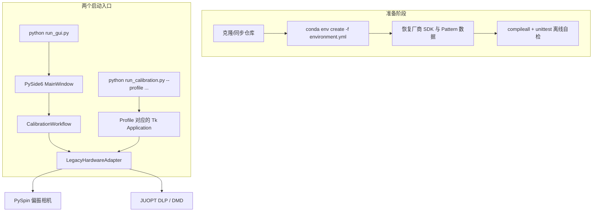

本文面向第一次接触 TMCalib 的开发者，目标是在 **30 分钟内**完成环境搭建、数据恢复与启动验证。TMCalib 用于 JUOPT DLP/DMD 与 FLIR/Teledyne 偏振相机的传输矩阵测量、GGS2-1 重建和逐点聚焦。若你还不了解各 Profile 的光学含义，建议先阅读 [项目概览：光传输矩阵测量与逐点聚焦平台](1-xiang-mu-gai-lan-guang-chuan-shu-ju-zhen-ce-liang-yu-zhu-dian-ju-jiao-ping-tai)，再回到本页动手。

Sources: [README.md](README.md#L1-L5)

## 启动链路一览

仓库提供两种启动入口，但**不提供两套实验逻辑**：图形入口 `run_gui.py` 走模块化的 `CalibrationWorkflow`，命令行入口 `run_calibration.py` 保留经实验验证的 Tk 程序；两者最终都驱动同一批 PySpin 相机与 JUOPT DMD 控制器。理解这一点可以避免"哪个入口才是官方版本"的困惑——PySide6 是新界面，Tk 入口作为硬件回退对照继续保留。



`tmcalib_gui` 只做渲染与输入，把曝光、预览、测量、重建、聚焦等操作委托给与 UI 框架无关的 `CalibrationWorkflow`；`tmcalib.bootstrap` 作为组合根，把 `LegacyHardwareAdapter` 注入工作流。适配器**延迟加载**厂商控制器——这意味着"导入 GUI"和"运行离线测试"都不会触碰 PySpin 或 JUOPT。

Sources: [tmcalib_gui/app.py](tmcalib_gui/app.py#L46-L104)、[tmcalib/bootstrap.py](tmcalib/bootstrap.py#L11-L28)、[tmcalib/adapters/legacy.py](tmcalib/adapters/legacy.py#L36-L94)

## 前提条件速查

动手前先逐项核对下表。**最关键的约束是 Python 版本**：JUOPT 的厂商扩展名为 `JUOPT_V4_PYTHON_DLL.cp38-win_amd64.pyd`，把测量环境固定为 Windows x64 + CPython 3.8，无法在 Linux 或更高 Python 版本上直接跑测量链路。

| 项目 | 要求 | 说明 |
| --- | --- | --- |
| 操作系统 | Windows x64 | 厂商 Pyd 为 `cp38-win_amd64`，无跨平台选项 |
| Python | CPython 3.8（64 位） | 用 conda 环境 `tmcalib` 锁定 |
| GPU | NVIDIA + CUDA 12.1 驱动 | 正式大矩阵重建依赖可用的 CUDA GPU |
| 相机驱动 | Spinnaker / PySpin（厂商安装） | 不能由 pip 安装 |
| DMD 驱动 | JUOPT DLP V4 SDK（厂商安装） | DLL 需恢复到仓库内指定相对路径 |
| Pattern 数据 | 数十 GiB 预生成 Probe/Pattern | 由 `.gitignore` 排除，需单独恢复 |

Sources: [README.md](README.md#L46-L62)、[requirements.txt](requirements.txt#L1-L12)

## 步骤 1：创建 Python 环境

推荐直接用 conda 从 `environment.yml` 创建，它会一次性安装 Python 3.8、PyTorch 2.4.1（CUDA 12.1）与全部普通依赖：

```powershell
conda env create -f environment.yml
conda activate tmcalib
```

若不想用 conda，可先安装与显卡驱动匹配的 PyTorch，再安装普通依赖：

```powershell
pip install torch==2.4.1 --index-url https://download.pytorch.org/whl/cu121
pip install -r requirements.txt
```

Sources: [environment.yml](environment.yml#L1-L19)、[README.md](README.md#L55-L60)

安装完成后在仓库根目录运行三条自检命令，**第一条必须输出 `64`**，第二条确认 PySpin 可用，第三条确认 CUDA GPU 可达。任何一条失败都不要继续连硬件——先回到 [硬件与厂商 SDK 环境配置](3-ying-jian-yu-han-shang-sdk-huan-jing-pei-zhi) 解决。

| 命令 | 预期输出 |
| --- | --- |
| `python -c "import struct; print(struct.calcsize('P') * 8)"` | `64` |
| `python -c "import PySpin; print('PySpin OK')"` | `PySpin OK` |
| `python -c "import torch; print(torch.__version__, torch.cuda.is_available())"` | `2.4.1 True`（或匹配的 CUDA 版本） |

Sources: [docs/HARDWARE_SETUP.md](docs/HARDWARE_SETUP.md#L5-L19)

## 步骤 2：恢复厂商 SDK 与 Pattern 数据

克隆仓库后，**Git 里没有** DMD 驱动、DLL 和任何 Pattern 数据——它们由 `.gitignore` 排除，以免把数 GiB 到上百 GiB 的二进制提交进版本库。必须从原实验环境或厂商安装包按以下相对路径恢复到仓库根目录下，程序才按原相对路径找到它们：

```text
JUOPT_DLP V4.0.002 20250522 release/4.DLL/DLL/JUOPT_DLL_V4.dll
pregenerated_patterns_8N/
pregenerated_patterns_128x96_fill_8N_full/
pregenerated_patterns_160x120_fill_8N_full/
pregenerated_patterns_128_px4_active512_8N_full/
```

各目录与启动 Profile 的对应关系如下。恢复时建议先只恢复你要跑的那个 Profile 的数据——单是 160×120 的 Probe + Pattern 就约 134.5 GiB。

| 恢复路径（相对仓库根目录） | 服务的 Profile | 量级（Probe + Pattern） |
| --- | --- | --- |
| `JUOPT_DLP V4.0.002 20250522 release/4.DLL/DLL/JUOPT_DLL_V4.dll` | 全部（DMD 加载） | 厂商二进制 |
| `pregenerated_patterns_8N/` | `v4_32x24`、`v4_32x24_cholesky` | 由 32×24 输入决定 |
| `pregenerated_patterns_128x96_fill_8N_full/` | `fourfold_128x96` | 约 81 GiB |
| `pregenerated_patterns_160x120_fill_8N_full/` | `fivefold_160x120` | 约 134.5 GiB |
| `pregenerated_patterns_128_px4_active512_8N_full/` | `dense_128x128`、`dense_128x128_roi26` | 约 112 GiB |

注意：完整测量会把 memmap 测量矩阵与重建输出写到仓库根目录下的工作区，恢复与归档细节见 [数据管理与实验归档规范](25-shu-ju-guan-li-yu-shi-yan-gui-dang-gui-fan)。

Sources: [README.md](README.md#L126-L138)、[docs/DATA_MANAGEMENT.md](docs/DATA_MANAGEMENT.md#L4-L20)

## 步骤 3：不连硬件的快速自检

硬件到位前，可以先验证仓库自身的代码完整性。在仓库根目录执行：

```powershell
python -m compileall -q .
python -m unittest discover -s tests -v
```

这两条命令**不需要相机和 DMD**：模块化测试通过一个 `FakeHardware` 同时扮演相机、测量、重建、聚焦等全部端口，验证 `CalibrationWorkflow` 的操作排序、Profile 能力契约、聚焦边界和"构建工作流不导入厂商模块"等约束。若本机没有 CUDA，`test_low_precision_pinv.py` 中带 CUDA 前缀的用例会自动跳过，其余照常通过。

Sources: [README.md](README.md#L151-L158)、[tests/test_modular_workflow.py](tests/test_modular_workflow.py#L1-L88)、[tests/test_low_precision_pinv.py](tests/test_low_precision_pinv.py#L11-L14)

## 步骤 4：启动标定流程

所有启动命令**必须从仓库根目录执行**，以保持 SDK、Pattern 和输出文件的相对路径一致。GUI 启动前还应确认 DMD、相机、触发线、曝光和光路功率处于安全状态——程序会直接控制实验硬件。

Sources: [README.md](README.md#L64-L98)

### 4.1 PySide6 统一控制台（推荐入口）

```powershell
python run_gui.py
```

统一控制台把 Profile 选择、偏振通道、相机图像、曝光、测量、重建、逐点聚焦、一键流程、停止、进度与日志集中到一个窗口。窗口主要区域如下：

| 区域 | 用途 |
| --- | --- |
| 实验配置 | 选择 Profile 与偏振通道（仅偏振 Profile 可用）；下方显示当前配置的输入/相机/有效区摘要 |
| 设备 | "连接相机与 DMD"、"停止当前任务" |
| 相机控制 / 相机图像 | 曝光时间设定（默认值取自 Profile）、启用/停止图像预览、实时画面 |
| 统一标定流程 | `1. 开始测量` → `2. 恢复传输矩阵` → `3. 逐点聚焦`，或 `一键：测量 → 恢复 → 逐点报告` |
| 共轭聚焦 | 输入目标 X/Y 坐标执行单点聚焦 |
| 运行日志 / 进度 / 系统状态 | 事件驱动的日志、进度条与状态反馈 |

首次运行的推荐操作顺序：选择 Profile → 连接设备 → 用预览确认图像正常 → 按编号点击流程按钮。按钮可用性由所选 Profile 声明的能力动态决定，例如不支持 `one_click` 的 Profile 会禁用一键按钮。

Sources: [run_gui.py](run_gui.py#L1-L8)、[tmcalib_gui/app.py](tmcalib_gui/app.py#L137-L213)、[tmcalib_gui/app.py](tmcalib_gui/app.py#L452-L490)

### 4.2 命令行启动各 Profile

当实验电脑没有桌面环境，或需要脚本化运行时，用 `run_calibration.py` 直接启动各 Profile 对应的 Tk 程序。命令格式如下：

```powershell
# 原 v4：32×24 输入
python run_calibration.py --profile v4_32x24

# 4 倍：128×96 输入按 8×8 宏像素铺满 DMD，128×128 相机输出
python run_calibration.py --profile fourfold_128x96

# 5 倍：160×120 输入扩展后铺满 DMD，128×128 相机输出
python run_calibration.py --profile fivefold_160x120

# 128×128 输入、128×128 相机输出
python run_calibration.py --profile dense_128x128

# 128×128 输入、26×26 相机输出，I0 / I90 通道
python run_calibration.py --profile dense_128x128_roi26 --channel I0
python run_calibration.py --profile dense_128x128_roi26 --channel I90
```

| CLI 参数 | 规则 |
| --- | --- |
| `--profile` | 必填，六个值之一，见上表 |
| `--channel` | **仅** `dense_128x128_roi26` 可用（`I0`/`I90`，默认 `I0`）；其它 Profile 传入会直接报错 |

各 Profile 的相机 ROI、DMD 有效区、默认曝光等完整规格在 `tmcalib/profiles.py` 中以 `ProfileSpec` 登记，不同 Profile 的尺寸与光学映射差异由 Profile 和编码策略隔离——这就是 [Profile 配置模型与能力声明](8-profile-pei-zhi-mo-xing-yu-neng-li-sheng-ming) 一页详述的内容。

Sources: [run_calibration.py](run_calibration.py#L7-L41)、[tmcalib/profiles.py](tmcalib/profiles.py#L51-L156)

### 4.3 启动前安全检查清单

| 检查项 | 说明 |
| --- | --- |
| 设备接线 | DMD、相机、电源、触发线连接正确 |
| 曝光与功率 | 确认不会造成相机饱和或器件损伤 |
| 资源占用 | 关闭可能占用相机或 GPU 的其他程序 |
| Pattern 与通道 | 核对所选 Profile、Pattern 数据集和偏振通道 |
| 数据文件 | 完整测量期间不要移动、重命名 memmap 或进度文件 |

首次连接硬件建议先做 **64 Pattern 光学测试**完成冒烟检查，再进入完整标定——具体入口与判定标准见 [64 帧光学测试与硬件冒烟检查](6-64-zheng-guang-xue-ce-shi-yu-ying-jian-mou-yan-jian-cha)。

Sources: [docs/HARDWARE_SETUP.md](docs/HARDWARE_SETUP.md#L21-L43)

## 下一步：按你的角色继续

| 目标 | 建议阅读 |
| --- | --- |
| 理解两种入口各自能做什么、怎么选 | [命令行启动各标定 Profile](4-ming-ling-xing-qi-dong-ge-biao-ding-profile)、[PySide6 统一桌面控制台操作](5-pyside6-tong-zhuo-mian-kong-zhi-tai-cao-zuo) |
| 深入相机–DMD 触发与采集链路 | [相机–DMD 触发时序与采集链路](13-xiang-ji-dmd-hong-fa-shi-xu-yu-cai-ji-lian-lu) |
| 理解模块化架构与依赖方向 | [模块化架构与依赖方向约束](7-mo-kuai-hua-jia-gou-yu-yi-lai-fang-xiang-yue-shu) |
| 想改动/新增一个光学配置 | [Profile 配置模型与能力声明](8-profile-pei-zhi-mo-xing-yu-neng-li-sheng-ming) |