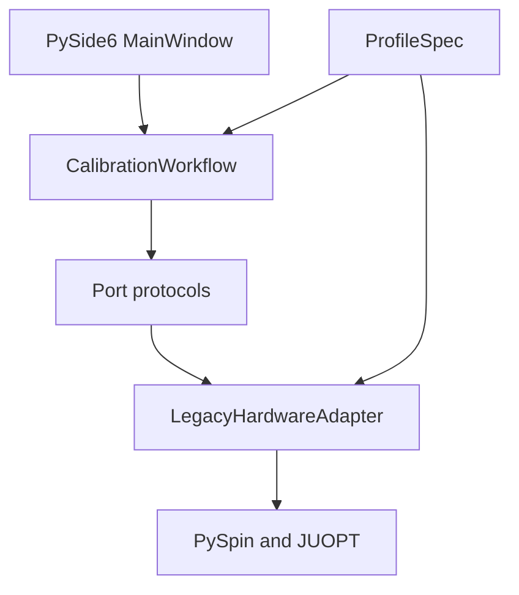

# TMCalib modular architecture

The PySide6 application has one user interface and one application workflow.
Experiment variants are immutable Profiles; they do not own windows, threads,
or hardware lifecycle code.

## Configuration dimensions

- Input grids: 32×24, 128×96, 160×120, or 128×128.
- DMD mappings: full 1024×768 aligned repeat, nearest-fill expansion, or a central 512×512 active region.
- Camera outputs: 128×128 or 26×26.
- Polarization channels: I0 or I90.
- Pattern sets: 64-frame optical test, 4N, or 8N.
- Reconstruction: ordinary pseudoinverse, Cholesky, or planar-complex32 low-precision inverse.

Stable identifiers remain defined in `calibration_profiles.py`. Output names must
include the input Profile, pattern set, and polarization channel where relevant.

## Dependency direction

`tmcalib.workflow` depends only on Protocol interfaces from `tmcalib.ports`.
It does not import Qt, Tkinter, PySpin, JUOPT, or any calibration script.
`tmcalib.bootstrap` is the composition root: it resolves a Profile, creates the
concrete adapter, and injects it into the workflow. This is the only layer that
chooses an implementation.

| Layer | Responsibility | May depend on |
| --- | --- | --- |
| `tmcalib_gui` | Rendering and user input | workflow, events, profiles |
| `tmcalib.workflow` | Connect/measure/reconstruct/focus use cases | ports, events, profiles |
| `tmcalib.ports` | Stable hardware and algorithm contracts | Python standard library |
| `tmcalib.profiles` | Dimensions, defaults, capabilities, strategy keys | Python standard library |
| `tmcalib.adapters` | Translate ports to existing hardware controllers | legacy scripts and vendor SDKs |
| legacy scripts | Experiment-tested acquisition and trigger sequences | vendor SDKs and algorithms |

## 128×96 full-field mapping

`fourfold_128x96` uses a 128×96 logical input. Each input maps to an aligned
8×8 DMD macro-pixel: samples are repeated twice on both axes to form a 256×192
optical grid and then encoded with 4×4 `holo_SP` tiles. All 1024×768 mirrors are
active, with metadata contract `aligned_repeat2_128x96_to_256x192_v1`.

## 160×120 full-field mapping

`fivefold_160x120` expands its 160×120 source to the 256×192 optical grid with
center-aligned nearest-neighbor indices before 4×4 tile encoding. Its metadata
contract is `nearest_fill_160x120_to_256x192_v1`.

## Unified feature contract

Every Profile currently exposes the same baseline capabilities:

- camera connection, exposure control, and preview;
- TM measurement and reconstruction;
- coordinate-validated conjugate focusing;
- progress, result, error, and frame events.

Optional features such as polarization selection, one-click calibration, and
remote reconstruction are declared as capabilities. The GUI reads that data to
enable controls. It does not switch on filenames or import a Profile-specific UI.

The 128×96 and 160×120 configurations reuse the shared 128×128-output camera,
acquisition, reconstruction, and focusing implementation through thin mapping
layers. The 26×26 I0/I90 variants likewise share the configurable core.

To add a feature that must exist for every configuration:

1. Add or extend one Protocol in `tmcalib.ports`.
2. Implement the operation once in `CalibrationWorkflow`.
3. Bind one GUI control to that workflow operation.
4. Implement the Protocol in hardware adapters and test with `FakeHardware`.

No Profile file should copy the GUI or workflow. A new optical configuration is
normally one `ProfileSpec` plus an encoder/reconstructor adapter strategy.

## Compatibility boundary

Hardware trigger timing remains inside the legacy controllers. The adapter loads
them lazily, so importing the GUI or running tests does not import vendor SDKs.
The old `run_calibration.py` command continues to launch the retained Tk entry
points for hardware rollback and comparison.

`calibrate_128x128_26x26.py` is now only a thin configuration wrapper around
`calibrate_128x128.py`; fixes in the shared camera/controller implementation are
therefore inherited by both ROI sizes. `calibrate_160x120.py` still adapts legacy
module constants, so the compatibility adapter reloads the shared core before
each new backend is composed. This prevents sequential Profile switches from
retaining dimensions from a previous run while the encoder is migrated to a
fully injected strategy.

## Threading and events

The workflow serializes hardware operations through a single-worker executor.
This protects the camera/DMD sequence from concurrent measurement,
reconstruction, and focus requests. Framework-neutral events are published from
the worker thread; `QtEventBridge` queues them onto the GUI thread before any
widget is touched.

## Tests

The dependency-injection tests use one `FakeHardware` object for every port. They
verify the shared workflow, profile capability contract, one-click ordering,
focus bounds, and lazy vendor imports without requiring a camera or DMD.
